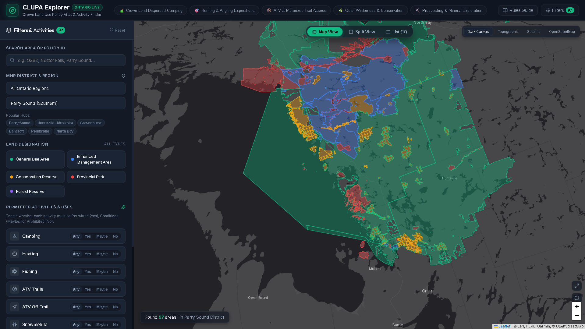

# 🌲 Ontario CLUPA Explorer

A modern, fast, and intuitive explorer for the **Ontario Crown Land Use Policy Atlas (CLUPA)**. Designed for campers, hunters, anglers, off-road enthusiasts, and outdoor adventurers who want to easily find where they can legally access and enjoy public Crown land across Ontario.



---

## ✨ Features

### 🔍 Filter-First Activity Finder
Unlike the legacy atlas, start directly with the activities you care about. Toggle permission levels (**Permitted / Yes**, **Conditional / Maybe**, or **Prohibited / No**) for:
* ⛺ **Crown Land Camping**: Dispersed backcountry camping on public land.
* 🎯 **Hunting**: Big game, small game, and waterfowl according to WMU seasons.
* 🎣 **Sport Fishing**: Angling across inland waterways and lakes.
* 🛞 **ATV & Off-Road**: Forest access roads and designated motorized trails (on-trail and off-trail).
* ❄️ **Snowmobiling**: Winter trail systems and backcountry riding.
* 🥾 **Hiking & Non-Motorized Travel**: Trekking, canoe tripping, portaging, and mountain biking.
* 🚤 **Boating & Watercraft**: Motor boat usage and floatplane landing.
* 🍄 **Food Gathering & Foraging**: Berry picking and edible wild mushrooms.
* ⛏️ **Mineral Exploration & Prospecting**: Claim staking and exploration.
* 🪵 **Commercial Forestry**: Sustainable timber management areas.

---

### ⚡ 1-Click Adventure Presets
* ⛺ **Crown Land Dispersed Camping**: Instantly highlights General Use and Enhanced Management areas open for free camping.
* 🎯 **Hunting & Angling Expeditions**: Surfaces public areas where both hunting and sport fishing are permitted.
* 🛞 **ATV & Motorized Trail Access**: Discovers backcountry road networks and motorized trail corridors.
* 🌿 **Quiet Wilderness & Conservation**: Highlights low-impact conservation reserves and non-motorized natural areas.
* ⛏️ **Prospecting & Mineral Exploration**: Identifies Crown lands open for mineral claim staking.

---

### 🗺️ Interactive Cartography
* **Color-Coded Vector Polygons**: Crown land boundaries color-coded by designation:
  * 🟢 **General Use Area (G)**: Multi-use Crown lands with minimal restrictions.
  * 🔵 **Enhanced Management Area (E)**: Areas with special management priorities (recreation, access, or fish/wildlife).
  * 🟠 **Conservation Reserve (C)**: Protected natural landscapes with low-impact recreation permitted.
  * 🔴 **Provincial Park (P)**: Regulated parks (requires Ontario Parks permits/fees).
  * 🟣 **Forest Reserve (F)**: Prospective conservation lands with existing mineral tenure.
* **4 High-Detail Basemaps**:
  * **Dark Canvas**: High-contrast minimal map with clear road and boundary labels.
  * **Topographic**: Detailed contours, elevations, rivers, and water bodies.
  * **Satellite**: High-resolution aerial imagery for scouting campsites, clearings, and access roads.
  * **OpenStreetMap**: Standard trail, road, and topography mapping.
* **Smart Navigation**: Locate Me (GPS location), auto-zoom to district, and hover tooltips.

---

### 📋 Deep-Dive Policy Inspector
Click on any area card or map polygon to inspect:
* **Government Management Intent**: Read official Ministry directives on how the land is managed.
* **Area Setting & Description**: Details on lakes, terrain, and regional values.
* **Full Permitted Uses Matrix**: Searchable table detailing every permitted activity and specific Ministry guidelines.
* **Navigation & Export Tools**:
  * 📍 Copy exact latitude/longitude GPS coordinates.
  * 🗺️ One-click "Open in Google Maps" for route navigation.
  * 💾 Download boundaries as standard **GeoJSON** for use in Gaia GPS, OnX Hunt, or GIS applications.
  * 🔗 Direct link to the official Ontario Ministry Policy Report.

---

### 📖 Ontario Regulations & 21-Day Camping Guide
Built-in reference guide covering:
* **The 21-Day Camping Rule**: Free camping for Canadian residents (must move camp at least 100m after 21 days per calendar year per site) and non-resident permit rules.
* **Fire Safety & Restricted Fire Zones (RFZ)**: Campfire ethics and safety guidelines.
* **Motorized Road Regulations**: Helmet, plate, and insurance requirements on Crown forest roads.

---

## 🚀 How to Run Locally

### Prerequisites
* [Node.js](https://nodejs.org/) (version 18 or higher)

### Setup & Run
```bash
# 1. Clone the repository
git clone https://github.com/monolith1/ontario_clupa_explorer.git
cd ontario_clupa_explorer

# 2. Install dependencies
npm install

# 3. Start local development server
npm run dev
```

Open your browser and navigate to **`http://localhost:5173/`**.

### Building for Production
```bash
npm run build
```
Creates an optimized, minified production build in the `dist/` directory.

---

## 🗺️ Data Source & Attribution
* **Crown Land Use Policy Atlas (CLUPA)**: Spatial boundaries, policy reports, and permitted activity tables are provided by the **Ontario Ministry of Natural Resources (MNR)** and **Geospatial Ontario** under the [Open Government Licence – Ontario](https://www.ontario.ca/page/open-government-licence-ontario).
* **Basemaps**: Esri World Dark Gray Canvas, Esri World Topographic, Esri World Imagery, and OpenStreetMap.
